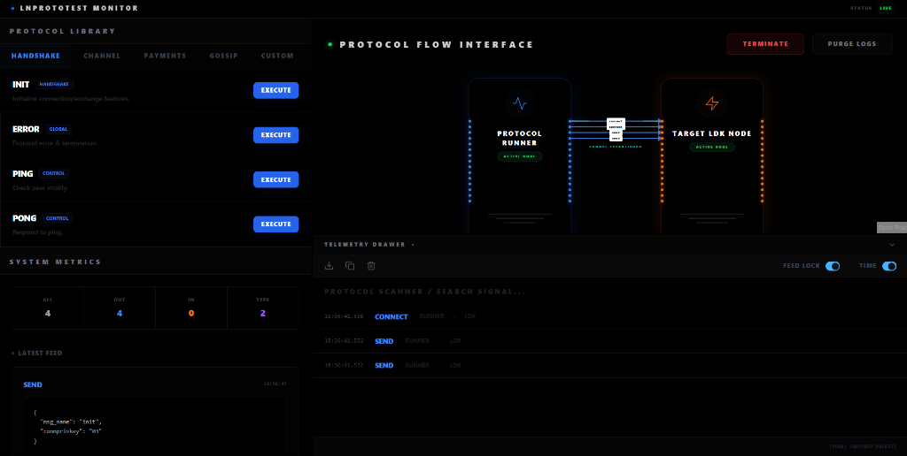
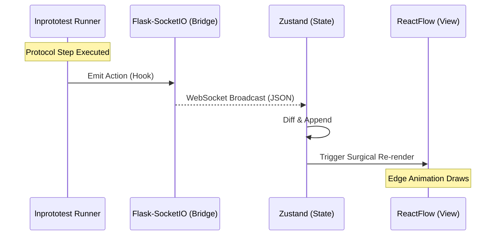

<div align="center">
  <h1>⚡ lnprototest Visualizer</h1>
  <p><strong>A High-Density Protocol Telemetry & Introspection Dashboard for the Lightning Network</strong></p>
  
  <p>
    <i>Internship Proof of Work • <b>Summer of Bitcoin 2025</b></i><br>
    <i>Lead Engineer: <b>Aryan Jain</b></i><br>
    <i>Organization: <b>lnprototest (Rusty Russell)</b></i>
  </p>

  
</div>

---

## � Executive Summary

The **lnprototest Visualizer** is a specialized engineering platform built to transform the granular, often opaque terminal logs of the `lnprototest` execution engine into a real-time, high-fidelity visual telemetry stream. 

By leveraging a bridge-architecture between asynchronous Python backends and high-performance React frontends, researchers can now visually audit BOLT (Basis of Lightning Technology) message flows, handshake sequences, and HTLC state transitions with millisecond precision.

---

## 🏗️ System Architecture & Data Flow

### The Telemetry Pipeline
The project implements a "Bridge Pattern" to decouple protocol execution from UI rendering. This ensures that even heavy cryptographic computations in the runner do not degrade the 60FPS dashboard experience.



### Backend: The Telemetry Streamer (`lightning-events`)
*   **Custom Runner Logic**: [model.py](file:///c:/Users/maila/Desktop/SummerOfBitcoin/revamp%20sob/lightning-event-viewer/lightning-events/model.py) implements `LightningAppRunner`. Unlike the default runner which drops packets, this specialized class implements automated BOLT logic (e.g., Ping/Pong responses) to simulate a "live" node.
*   **Monkeypatching for Introspection**: We intercept `lnprototest.Connect`, `RawMsg`, and `ExpectMsg` classes. By overriding the `action()` method, we capture the internal state of the packet (direction, hex payload, decrypted fields) and stream it via SocketIO.

### Frontend: The Reactive Visualizer (`lnprototest-visualizer`)
*   **Zustand for High-Volume Logs**: Traditional React state or Context would suffer from "Head-of-Line Blocking" when processing hundreds of protocol messages. Zustand allows us to update the `messages` array in a non-blocking way.
*   **ReactFlow Dynamic Edges**: Every message in the log is dynamically rendered as a directed edge. The system automatically calculates source/target handles to prevent edge-overlap in complex handshake sequences.

---

## � Engineering Deep-Dives

### 1. Protocol Message Schema
All events streamed to the frontend follow a standardized telemetry schema:
```json
{
  "sequence_id": "pk_0xabc...",
  "direction": "out", // 'in' for expectations, 'out' for injections
  "event": "open_channel",
  "data": {
    "connprivkey": "0x...",
    "payload": { ...BOLT_FIELDS... }
  },
  "timestamp": 1700000000000
}
```

### 2. BOLT Specification Support
| BOLT # | Feature | Status |
| :--- | :--- | :--- |
| **BOLT 1** | Base Protocol (Handshake, Ping/Pong) | ✅ Fully Optimized |
| **BOLT 2** | Channel Management (Open/Accept) | ✅ Visualized |
| **BOLT 8** | Encrypted Transport (Noise Protocol) | 🔄 Under Research |
| **BOLT 11** | Invoices | ✅ Telemetry Supported |

### 3. Performance & Scaling
To maintain high-density visualization, the frontend implements:
*   **Virtual Scrolling**: The Telemetry Drawer only renders visible logs.
*   **Memoized Graph Diffing**: ReactFlow nodes only re-position if the sequence ID changes.

---

## 🛠️ Tech Stack & Methodology

| Component | Technology | Engineering Rationale |
| :--- | :--- | :--- |
| **Backend Framework** | Flask + Flask-SocketIO | Lightweight overhead with robust WebSocket support via Eventlet. |
| **Protocol Engine** | `lnprototest` (Python) | Direct integration with the industry-standard BOLT test suite. |
| **Frontend UI** | React 18 + Vite | Rapid Hot-Module Replacement (HMR) for protocol development. |
| **Styling** | Tailwind CSS + Cloudscape | High-density developer experience (DX) with consistent UI patterns. |
| **Visual Graph** | ReactFlow | Extensible SVG-based graph engine for complex network topologies. |

---

## 📥 Deployment Guide

### Prerequisites
*   **Python 3.12+** and **Poetry**
*   **Node.js 18+** and **Bun** (for faster dependency resolution)

### Step 1: Backend Setup
```bash
cd lightning-events
poetry install
poetry run python wsgi.py
```

### Step 2: Frontend Setup
```bash
cd lnprototest-visualizer
bun install
bun dev
```

---

## 🤝 Contribution & Protocol Research
The project is designed for extensibility. To add a new protocol visualizer:
1.  Define the message type in [lnprototest-visualizer/src/store/index.ts](file:///c:/Users/maila/Desktop/SummerOfBitcoin/revamp%20sob/lightning-event-viewer/lnprototest-visualizer/src/store/index.ts).
2.  Update the `LightningAppRunner` in [lightning-events/model.py](file:///c:/Users/maila/Desktop/SummerOfBitcoin/revamp%20sob/lightning-event-viewer/lightning-events/model.py) to handle the automated response logic.
3.  The frontend will automatically pick up the new event type and render it in the graph.

---

<div align="center">
  <p>Engineered with ⚡ by <a href="https://github.com/AryanJain">Aryan Jain</a></p>
</div>
